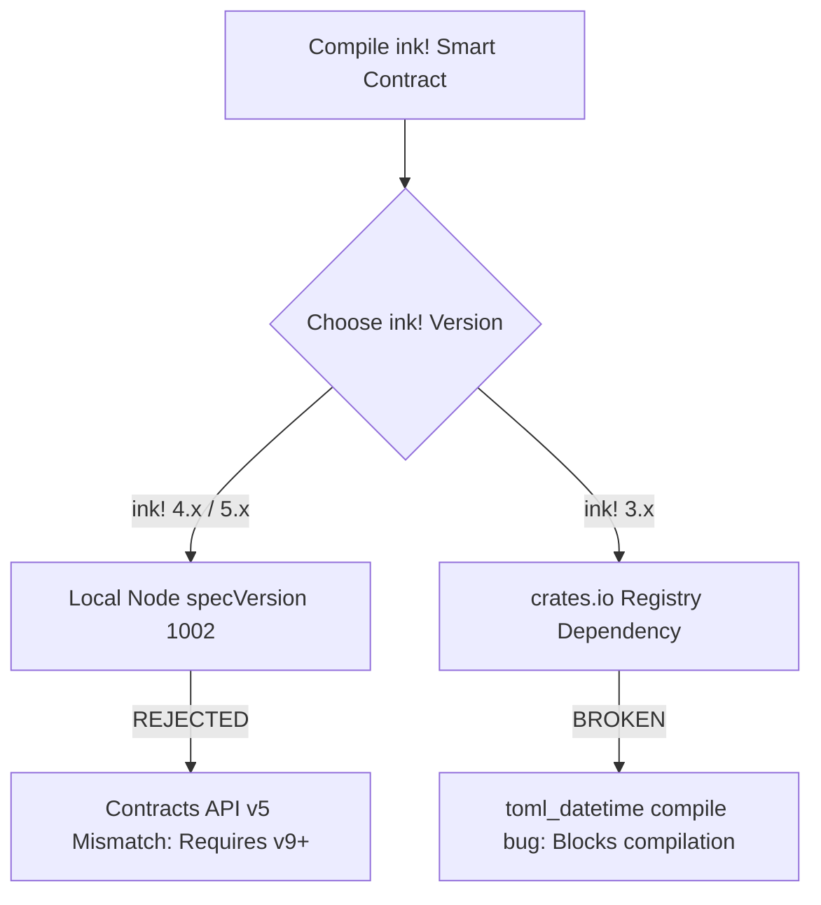

# 🟣 Portaldot Hackathon Knowledge Base & Node Runner Guide

This document compiles all critical technical research, known bugs, workarounds, and step-by-step guides for the **Portaldot Online Mini Hackathon (Season 1)**. Keep this as a single source of truth in your repository to guide your architectural decisions.

---

## 1. Portaldot Ecosystem Overview

Portaldot is an emerging Layer 0 public blockchain built on **Substrate**, utilizing **ink! (Rust-based)** Wasm smart contracts, and fueled by the native **POT** token for gas, staking, and governance.

* **Core Narrative:** Infrastructure for a "green, trusted digital civilization" and integrating Real-World Assets (RWA) with physical industry workflows.
* **Consensus:** LAO NPoS (Linear Attenuation Offset Nominated Proof of Stake).
* **Performance:** Claims up to 10,000+ TPS with sub-second finality via dynamic sharding.

---

## 2. Critical Blockers & Rejections (As of May 2026)

Several hackathon developers are running into critical issues when attempting to deploy custom smart contracts. Here is a breakdown of why this is happening and where the bugs are:



### ❌ The Local Node Blocker (Contracts API v5 vs. v9)
* **The Problem:** The current local development node binary (`portaldot_dev`, specVersion 1002) runs **Contracts API v5** (running since late 2023). Modern `ink! 4.x` and `5.x` smart contracts require **Contracts API v9+**.
* **The Result:** If you compile a contract using cargo-contract/ink! 4.x and try to deploy it to a local node, the node runtime will reject the WASM payload with a serialization/dispatch error.
* **No Client-Side Workarounds:** Attempting to bypass this on the client side—such as passing a simple `u64` gas limit format instead of `{ ref_time, proof_size }` or using alternative Polkadot.js Apps extrinsics—will **not** solve the runtime API mismatch. The node binary itself must be upgraded by the core team to support Contracts API v9+.
* **The `ink! 3.x` Trap:** Downgrading to `ink! 3.x` to match API v5 is blocked because compiling `ink! 3.x` is currently broken on Cargo/crates.io due to an upstream dependency bug with the `toml_datetime` crate.

---

## 3. Verified Developer Options & Workarounds

If you want to build and submit a working MVP before the **May 31, 2026 deadline**, there are two fully verified paths, depending on your application architecture:

### 🌐 Option A: Custom ink! 4.x Smart Contracts via Public Dev Node (Recommended for Custom Logic)
If your application requires custom state logic, gaming rules, or financial models, bypass the local node blocker by deploying to Portaldot's official public development environment. This node is fully updated with **Contracts API v9+** and fully supports **ink! 4.x**.

* **RPC Endpoint:** `wss://drip-backend-production-8d86.up.railway.app/node`
* **Toolchain Target:** `cargo-contract 4.x` + `ink! 4.x`
* **Pre-funded Account:** `Alice` is pre-funded on this public endpoint for easy developer deployment.

```javascript
const { ApiPromise, WsProvider } = require('@polkadot/api');
const provider = new WsProvider('wss://drip-backend-production-8d86.up.railway.app/node');
const api = await ApiPromise.create({ provider });
```

---

### 🏆 Option B: The Native Pallets Path (Recommended for Local-Only Execution)
If you want a highly stable application that runs perfectly on a local development node without any custom contract deployments, leverage Substrate's native runtime pallets. They are compiled directly into the blockchain runtime and are fully operational on both local and public nodes.

You can list and interact with them natively using `@polkadot/api`:

```javascript
// Connect to the node and list available pallets
const pallets = Object.keys(api.tx);
console.log(pallets);
```

#### Natively Available Pallets on Portaldot:
* `assets`: Create, mint, and manage custom fungible tokens (excellent for asset fractionalization).
* `uniques`: Create and manage dynamic or static NFTs (excellent for digital credentials/credentials).
* `identity`: On-chain profiles, reputation tracking, and registrar-verified credentials.
* `bounties`: Natively manage on-chain escrow pools, proposal deposits, and curator appointments.
* `staking`: Nominate validators, stake POT, and manage rewards.
* `balances`: Standard peer-to-peer POT transfers.
* `vesting`: Programmatically lock token releases.

---

### 💻 Option C: Manual Contract Deployment Workaround
If the `cargo-contract` CLI fails to deploy your contract to the public node due to local toolchain issues, you can upload and instantiate your compiled WASM manually:

1. **Via JavaScript (Polkadot.js Contract API):**
   ```javascript
   const { CodePromise } = require('@polkadot/api-contract');
   const code = new CodePromise(api, abi, wasm);
   const tx = code.tx.new({ gasLimit: 50000000000, storageDepositLimit: null });
   await tx.signAndSend(alice, callback);
   ```
2. **Via Polkadot.js Apps Web UI:**
   Connect to `wss://drip-backend-production-8d86.up.railway.app/node` via Polkadot.js Apps, navigate to **Developer -> Contracts** or **Developer -> Extrinsics -> contracts -> instantiateWithCode**, and upload your `.wasm` and `.json` metadata files manually.

---

## 4. Portaldot Local Node Runner Guide

To set up a local testing environment, run nodes, or claim validator/node running credits, follow this step-by-step setup guide.

> [!NOTE]
> This guide is based on the verified configurations from [Investorquab/portaldot-node-guide](https://github.com/Investorquab/portaldot-node-guide).

### 🖥️ Method 1: Linux / macOS / Windows (WSL2 Ubuntu)

1. **Install Prerequisites:**
   ```bash
   sudo apt update && sudo apt install wget tar -y
   ```
2. **Download and Extract Node Binary:**
   ```bash
   cd ~
   wget https://github.com/portaldotVolunteer/Portaldot-node/raw/main/portaldot-testnet-ubuntu.tar.gz
   tar -xzvf portaldot-testnet-ubuntu.tar.gz
   cd portaldot-testnet-ubuntu
   chmod +x portaldot_dev
   ```
3. **Start Alice (Bootnode):**
   ```bash
   ./portaldot_dev --dev --alice --name YOUR_USERNAME --base-path /tmp/alice
   ```
   *Copy Alice's unique `Peer ID` printed in the startup logs (e.g. `12D3KooW...`).*
4. **Start Bob (Peer Node - Open in a Second Terminal):**
   ```bash
   cd ~/portaldot-testnet-ubuntu
   ./portaldot_dev --dev --bob --name YOUR_USERNAME_BOB \
     --base-path /tmp/bob \
     --port 30334 \
     --rpc-port 9945 \
     --bootnodes /ip4/127.0.0.1/tcp/30333/p2p/PASTE_ALICE_PEER_ID
   ```

---

### ☁️ Method 2: GitHub Codespaces (No Installation Needed)
If you are on Windows without WSL or have machine limitations, you can run the node directly in a web browser using GitHub Codespaces.

1. Go to [github.com/portaldotVolunteer/Portaldot-node](https://github.com/portaldotVolunteer/Portaldot-node).
2. Click **Code** → **Codespaces** → **Create codespace on main**.
3. Once the terminal loads, execute:
   ```bash
   cd ~
   wget https://github.com/portaldotVolunteer/Portaldot-node/raw/main/portaldot-testnet-ubuntu.tar.gz
   tar -xzvf portaldot-testnet-ubuntu.tar.gz
   cd portaldot-testnet-ubuntu
   chmod +x portaldot_dev
   ```
4. Start **Alice**:
   ```bash
   ./portaldot_dev --dev --alice --name YOUR_USERNAME --base-path /tmp/alice
   ```
5. Click the `+` button in the terminal panel to open a new terminal tab and start **Bob**:
   ```bash
   cd ~/portaldot-testnet-ubuntu
   ./portaldot_dev --dev --bob --name YOUR_USERNAME_BOB \
     --base-path /tmp/bob \
     --port 30334 \
     --rpc-port 9945 \
     --bootnodes /ip4/127.0.0.1/tcp/30333/p2p/PASTE_ALICE_PEER_ID
   ```

---

### 📱 Method 3: Termux (Android Mobile Node Runner)
You can run a local Portaldot node directly from an Android phone!

1. Download **Termux** from [F-Droid](https://f-droid.org/packages/com.termux/) *(do not use the Play Store version, it is outdated).*
2. Update packages and install dependencies:
   ```bash
   pkg update && pkg upgrade -y
   pkg install wget tar -y
   ```
3. Fetch the node binary and extract:
   ```bash
   cd ~
   wget https://github.com/portaldotVolunteer/Portaldot-node/raw/main/portaldot-testnet-ubuntu.tar.gz
   tar -xzvf portaldot-testnet-ubuntu.tar.gz
   cd portaldot-testnet-ubuntu
   chmod +x portaldot_dev
   ```
4. Run **Alice**:
   ```bash
   ./portaldot_dev --dev --alice --name YOUR_USERNAME --base-path /tmp/alice
   ```
5. Swipe from the left edge of Termux, tap **New Session**, and run **Bob**:
   ```bash
   cd ~/portaldot-testnet-ubuntu
   ./portaldot_dev --dev --bob --name YOUR_USERNAME_BOB \
     --base-path /tmp/bob \
     --port 30334 \
     --rpc-port 9945 \
     --bootnodes /ip4/127.0.0.1/tcp/30333/p2p/PASTE_ALICE_PEER_ID
   ```

---

## 5. Node Running Verification & Verification Rules

To report your local node setup to the Portaldot team for rewards or testing validation:

1. **Naming Rule:** You **must** pass your exact developer username in the `--name` parameter:
   ```bash
   # ✅ Correct:
   ./portaldot_dev --dev --alice --name investorquab --base-path /tmp/alice
   ```
2. **Telemetry Screenshot:** Take a screenshot of the running terminal showing `💤 Idle (1 peers)` with your custom node name visible.
3. **Connect to Explorer:**
   Open your browser to [polkadot.js.org/apps/?rpc=ws%3A%2F%2F127.0.0.1%3A9944#/explorer](https://polkadot.js.org/apps/?rpc=ws%3A%2F%2F127.0.0.1%3A9944#/explorer) to see blocks producing in real-time.
   *Alternatively, use the developer playground:* [portaldot-playground.vercel.app](https://portaldot-playground.vercel.app).
4. **Submit Bug Reports:** Submit screenshots and wallet details to the official [Portaldot Notion Bug Report](https://www.notion.so/Portaldot-Local-Development-Node-Installation-Guide-on-Windows-via-WSL2-2e06bdef409680618bf6dbcaa1423508).

---

## 6. Common Node Runner Troubleshooting

### 🔒 Lock File Errors
* **Error:** `Error: While lock file: .../LOCK: Resource temporarily unavailable`
* **Fix:** Delete the active lock file left over from a previous crash:
  ```bash
  rm /tmp/alice/chains/dev/db/LOCK
  rm /tmp/bob/chains/dev/db/LOCK
  ```

### 🚫 Port Already in Use
* **Error:** `Error: Address already in use`
* **Fix:** Terminate any dangling background node processes:
  ```bash
  pkill portaldot_dev
  ```

### 🫥 Node is Idle with 0 Peers
* **Fix:** 
  1. Confirm Alice is fully running before starting Bob.
  2. Verify you copied the exact peer ID outputted in Alice's terminal log.
  3. Wait up to 60 seconds for local peer discovery to settle.

---

## 7. Hackathon Submission & Deployment Requirements

> [!IMPORTANT]
> **Must we deploy our project on a live public interface?**
> **No, a hosted frontend is not strictly necessary, but a verified smart contract deployment is highly recommended.**

As confirmed in the developer community chat, a live public UI is not strictly required. The judges' protocol is to clone your GitHub repository and follow your local guide to test the project.

### Key Rules for Your Submission & Winning Strategy:
* **The "Local Review" Standard:** You must submit your project’s complete source code along with a detailed, step-by-step installation and execution guide in your GitHub repository README.
* **The Public Node Edge:** Since the public dev node (`wss://drip-backend-production-8d86.up.railway.app/node`) is fully operational with Contracts API v9+ support, having your custom `ink! 4.x` contract deployed live on the public network is a massive competitive advantage. It proves to the judges that your smart contract is fully functional on-chain and ready for production.
* **Our Competitive Advantage:** Combine a pristine local setup guide, clean automated initialization scripts, and a fully functional UI that connects to the public dev node (with a mock/local fallback option if needed) to ensure a flawless judging experience.

